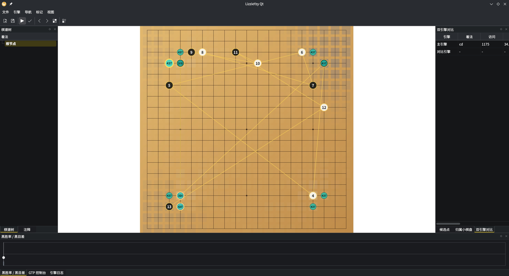

# LizzieYzy Qt



This project is an AI-assisted refactoring of the Java project [yzyray/lizzieyzy](https://github.com/yzyray/lizzieyzy) into a Qt application.

This directory contains the Qt 6/C++20 implementation described in the
repository-root `PLAN.md`. Installed packages include a copy of that plan next
to this README. The legacy Java application has been removed from the working
tree; repository history remains available as a behavior reference, and the Qt
application retains migration support for existing Java-version users.

## Current Scope

- `src/core`: board rules, checked move insertion, SGF tree/model data, SGF parse/write, analysis data
  containers.
- `src/engine`: KataGo GTP protocol helpers, analysis JSON request/response helpers, QProcess session
  workers, and UI-thread proxy objects that run realtime, compare, and batch engines on dedicated
  worker threads.
- `src/app`: application-level settings models, analysis state updates, persistence helpers, runtime
  update planning, game editing actions, SGF document-session save decisions, batch analysis run
  planning, request tracking, and completion planning, engine command planning and dispatch, engine session ownership, engine automation state and toggle planning,
  analysis stream guards, atomic file writes, legacy Java config import, and startup/SGF session
  restoration.
- `src/ui`: Widgets main window plus a `QQuickPaintedItem` board renderer, configurable shortcuts, file behavior settings, a raw GTP console, and a separate engine log dock.
- Board display settings include optional black/white stone texture image paths, ownership opacity, and whether ownership is drawn on the main board, a mini board dock, or both; invalid or empty texture paths fall back to generated vector stones.
- The Markup menu edits SGF labels, marks, and setup stones (`AB`/`AW`/`AE`) on the current node.
- New Game can create SGF-compatible square or rectangular boards up to 52 columns/rows. Standard
  square-board handicap games write matching `HA` and root `AB` stones. The dialog only offers
  `0` or `2` through `9` handicap choices, and disables handicap on board sizes without standard
  handicap points so unsupported choices are not preserved as empty `HA` metadata.
- Game Info editing preserves missing optional `RU`/`KM` fields unless the user explicitly enables them, and can clear existing rules, komi, and handicap values.
- The Engine menu includes one-shot AI moves, Human vs AI reply mode, KataGo self-play, and main-vs-compare engine games.
- Candidate tables show visits, winrate, score, policy, PV, and PV visit counts from KataGo analysis output.
- The analysis graph layers winrate, score, loss bars, and visit trends; hovering
  or clicking anywhere inside the plot selects the nearest move column.
- The GTP console keeps raw protocol traffic and command input; the Engine Log dock keeps KataGo stderr and process diagnostics from main, compare, and batch analysis engines.
- On first launch, the app can configure a complete local KataGo setup
  (executable, model, GTP config, and analysis config), import a Java
  `config.txt`, or continue in no-engine mode.
- Window geometry, dock layout, last opened SGF, and current tree node are restored through `QSettings`.
- `tests`: focused executable tests for core rules/SGF, GTP protocol parsing, analysis JSON,
  worker-thread engine proxies, settings round-trips, UI smoke, and stress coverage.
- Core SGF parsing supports SGF coordinates up to 52 columns/rows. Realtime
  KataGo/GTP sync and genmove are guarded to board widths that can be
  represented by standard GTP coordinates (`A` through `Z`, skipping `I`) and
  report diagnostics for wider SGF files. Batch analysis uses KataGo Analysis
  Engine JSON coordinates such as `(x,y)`, so wider SGF boards can still be
  analyzed and written to sidecar files or SGF analysis properties when the
  engine accepts the position.

## Build

```bash
cmake -S . -B build -G Ninja -DCMAKE_BUILD_TYPE=Debug
cmake --build build
ctest --test-dir build --parallel 2 --output-on-failure
```

Required packages are a C++20 compiler, CMake, Qt 6 Core/Widgets/Quick/QuickWidgets,
and Ninja or another CMake generator.
The first Qt release intentionally supports Linux and Windows only; CMake stops
configuration on macOS to match the repository-root `PLAN.md`.

## Run Installed Or Packaged Builds

After `cmake --install`, start the installed app with:

```bash
./install/bin/lizzieyzy_qt
```

After extracting a Linux package, run `LizzieYzyQt/bin/lizzieyzy_qt` from the
archive root. After extracting a Windows package, run
`LizzieYzyQt\bin\lizzieyzy_qt.exe`.
Use `--diagnostics` on the installed or packaged executable to print the Qt
platform plugin, Qt Quick graphics API, scene graph backend, renderer-interface
RHI/shader fields, OpenGL runtime context diagnostics, app executable path, app directory, process working
directory, app-local Qt runtime artifact diagnostics, runtime Qt library paths,
Qt plugin path status, QStandardPaths writable locations,
including config/data/cache/runtime, application font/text metrics,
locale/UI-language diagnostics, runtime appearance style/palette diagnostics,
native file dialog/settings path selector diagnostics,
main-window UI structure diagnostics,
QSettings storage location, stored and normalized appearance settings,
first-run completion diagnostics,
saved engine setting path diagnostics, stored engine path-readiness diagnostics, stored analysis option diagnostics,
stored board display diagnostics, stored file behavior diagnostics,
stored shortcut diagnostics,
QSettings session/window restore keys, saved session SGF path-status,
saved window-geometry visibility checks, current platform plugin candidates,
common Wayland platform plugin candidates, common Windows platform plugin candidates,
available platform plugin listing, target-platform summary diagnostics, Qt plugin environment,
Qt build/runtime version match, Qt install paths, user/profile/temp environment, session/display/runtime environment, QML import paths,
QML import environment, Qt Quick Controls configuration paths, OS product/kernel
details, Qt build ABI, build/current CPU architecture, OpenGL context
creation, vendor, renderer, and version strings, screen geometry, physical size, refresh rate,
average/per-axis DPI, scale factor, device-pixel geometry, screen orientation, virtual-sibling screen layout, and
extended graphics environment diagnostics for Qt scale rounding, Qt Quick render-loop/debug settings,
OpenGL/EGL vendor selection, NVIDIA/CUDA/Vulkan values, and
`__EGL_VENDOR_LIBRARY_FILENAMES` for target-machine
acceptance notes. Path-list environment diagnostics expand
`PATH`, `LD_LIBRARY_PATH`, `DYLD_LIBRARY_PATH`,
`QML_IMPORT_PATH`, `QML2_IMPORT_PATH`, `QT_QUICK_CONTROLS_STYLE_PATH`,
`QT_QPA_PLATFORM_PLUGIN_PATH`, `QT_PLUGIN_PATH`, `KWIN_DRM_DEVICES`,
`VK_ICD_FILENAMES`, `VK_DRIVER_FILES`, and
`__EGL_VENDOR_LIBRARY_FILENAMES` into entry counts and per-entry
path status; set-empty environment variables print `(empty)`, while unset
variables print `(unset)`. Blank path-list entries report `hasText: false` and
are not resolved as filesystem locations. The target-platform summary also reports NVIDIA hint sources from
explicit GPU variables and Vulkan/EGL/GBM path values containing NVIDIA, CUDA,
or TensorRT markers, target-platform blocker diagnostics, primary-screen and any-screen 4K/high-DPI summaries, display blocker diagnostics, and
same-screen target display summaries. PLAN acceptance candidate flags cover
Linux KDE Wayland + NVIDIA, Windows + NVIDIA, and target display conditions.
PLAN acceptance summary flags also combine target platform, real KataGo env
readiness, saved main/compare engine config readiness, env-or-saved main config
readiness, configured source diagnostics, configured acceptance status, display candidates, manual verification
candidate flags, manual verification blocker diagnostics, realtime GTP and batch-analysis acceptance candidate flags,
dual-engine acceptance candidate flags, mode-specific final acceptance blocker diagnostics, manual UI inspection checklist diagnostics, raw KataGo comparison checklist diagnostics, an external target verification checklist, target-specific verification checklist diagnostics, target-specific verification status diagnostics, and explicit manual-verification requirements
under `plan.acceptance.*`.
Filesystem path diagnostics include existence, type,
readability, writability, executable status, nonblank text status, size, and modification time where applicable. It also reports
`katago.env.executable`, `katago.env.model`, `katago.env.analysisConfig`, and
`katago.env.gtpConfig` path status plus a KataGo env readiness summary when the
`LIZZIE_KATAGO_*` environment variables are set for real-engine testing. The
`--target-acceptance-report` command prints a concise Markdown target-machine
acceptance report with the same `plan.acceptance.*` status fields, readiness
blockers, and checklist names for attachment to the final acceptance record.
Use `--target-acceptance-record-template` to print a complete INI skeleton for
the required target-machine metadata, evidence paths, manual results, and
checklist items before filling in final acceptance results; this template
command runs before Qt platform initialization so it remains available when
display setup is broken. Its `[recordHints]` section lists accepted pass/fail
values, `recordHint.metadataKeysRequired` metadata requirements, and the
evidence path, SHA-256, content-marker, and timestamp rules; the same guidance
is emitted as `plan.acceptance.recordHint.*` fields in `--diagnostics` and
`--target-acceptance-report` output. Pass
`--target-acceptance-record <ini>` with
`--diagnostics` or `--target-acceptance-report` to fold completed target-machine
results and evidence paths into the generated diagnostics; the
`--target-acceptance-record -- <ini>` form accepts record paths that start with
`-`. The
`LIZZIE_TARGET_ACCEPTANCE_RECORD_FILE` environment variable provides the same
record path for scripted runs. The generated output includes record-file
canonical path, size, SHA-256, and modification time. Final acceptance keeps an `acceptanceChecklist`
blocker until every target acceptance checklist item is recorded as pass, and
`plan.acceptance.checklistMissingRecord` lists checklist items that still need a record.
`[evidenceSha256]` pins are required for final acceptance; missing, invalid, or
mismatched pins keep an `acceptanceEvidenceSha256` blocker.
The target acceptance record also stores `appVersion` and
`appExecutableSha256`; they must match the generated `app.version` and the
current `app.executable` SHA-256 or final acceptance keeps an
`acceptanceMetadata` blocker.
It also stores `osPrettyName`, `osKernelType`, `osKernelVersion`,
`qtRuntimeVersion`, `qtBuildAbi`, `cpuArchitecture`, and `targetMachine`; those
must match the current `os.*`, `qt.*`, `cpu.*`, and machine host-name values so
records cannot be silently reused across different target OS, runtime, or
machine runs.
Invalid or failed manual acceptance records take priority in
`plan.acceptance.finalAcceptanceStatus` even when other target readiness blockers
are still present.
Evidence file modification times must not be later than `completedUtc` beyond
the built-in clock-skew tolerance, or final acceptance keeps an
`acceptanceEvidenceTimestamp` blocker.
Screenshot evidence also reports image format,
pixel dimensions, readability, and whether the captured image reaches a 4K
pixel envelope; final acceptance keeps a `screenshotEvidence4K` blocker until
that evidence is readable and reaches the 4K pixel envelope. The readiness summary reports `ready`, `missing`, or `invalid` with missing and
invalid path counts; unset or whitespace-only path values are treated as
missing.

KataGo, KataGo config files, and neural-network models are not bundled. On first
launch, use `Configure Engine` to point at a local KataGo executable, model, GTP
config, and analysis config, use `Import Java Config` to import a previous Java
configuration, or use `No Engine Mode` to inspect and edit SGF files without an
engine. See `docs/Migration.md`, `docs/PlanRequirementAudit.md`,
`docs/Verification.md`, and `docs/TargetAcceptanceReport.md` in the installed
documentation directory for migration, requirement-by-requirement evidence,
target-machine checks, and the final acceptance report template.

## Format

The repository root carries a `.clang-format` file. Run `clang-format` from the
repository root or pass `--style=file` so generated patches use the project style.

## Install and Package

```bash
cmake --install build --prefix "$PWD/install"
cmake --build build --target package
```

CPack emits platform-specific package filenames:
`LizzieYzyQt-<version>-Linux.tar.gz` on Linux and
`LizzieYzyQt-<version>-Windows.zip` on Windows. Each archive contains the
`lizzieyzy_qt` executable. Windows packaging runs Qt's CMake deployment helper
so the archive includes the Qt runtime libraries and plugins reported by Qt's
deploy tooling, and CI verifies the filename, app, docs, Qt Core/Gui/Widgets/Quick/
QuickWidgets/Qml/Network/OpenGL DLLs, and `platforms/qwindows.dll`. Linux
`.tar.gz` packages intentionally rely on the target system's Qt/KDE runtime
instead of copying distribution-owned plugin dependency trees. Runtime
`--diagnostics` prints app-local Qt runtime artifact diagnostics for these
expected libraries and common platform plugins so extracted Windows packages can
be checked on the target machine; CI runs Windows diagnostics through the native
`windows` QPA plugin, and the package
verifier rejects Windows runtime artifacts in Linux packages and Linux runtime
artifacts in Windows packages. KataGo,
KataGo config files, and neural-network model files are still user-provided
and are not bundled; config rejection covers common config file extensions such
as `.cfg`, `.conf`, `.yaml`, `.yml`, `.toml`, and config-named `.json`. The package verifier also rejects Java archives, bytecode,
bundled Java runtime directories, executables, and runtime libraries, and
non-KataGo engine artifacts plus out-of-scope artifacts for remote SSH engines,
online board integrations, screen board synchronization, and distributed
training so the first Qt release stays focused on the planned local KataGo scope. It also rejects macOS artifacts
such as app bundles, dynamic libraries, and frameworks because the first release
targets Linux and Windows only.

## Migration

See [docs/Migration.md](docs/Migration.md) for Java `config.txt` import behavior,
legacy `LZ/LZOP` SGF analysis import, Qt `LZYERR` failed-node diagnostics, and
sidecar analysis files.

## Verification

See [docs/PlanCoverage.md](docs/PlanCoverage.md) for the PLAN.md requirement
mapping that is covered by automated tests and packaging checks, and
[docs/PlanRequirementAudit.md](docs/PlanRequirementAudit.md) for a
requirement-by-requirement completion audit. See
[docs/Verification.md](docs/Verification.md) for target-platform checks that
need a real KataGo installation, KDE Wayland or Windows hardware, packaging, and
multi-display/high-DPI validation. Use
[docs/TargetAcceptanceReport.md](docs/TargetAcceptanceReport.md) to record the
target-machine diagnostics, generated `--target-acceptance-report` summary, and
manual acceptance results.

## Real KataGo Integration Test

`lizzie_katago_integration_tests` is enabled in CTest but skips by default. Set
these variables to run it against a real KataGo binary and model:

```bash
export LIZZIE_KATAGO_EXECUTABLE=/path/to/katago
export LIZZIE_KATAGO_MODEL=/path/to/model.bin.gz
export LIZZIE_KATAGO_ANALYSIS_CONFIG=/path/to/analysis.cfg
export LIZZIE_KATAGO_GTP_CONFIG=/path/to/gtp.cfg
ctest --test-dir build -R lizzie_katago_integration_tests --output-on-failure
```

The regular CTest suite also runs `lizzie_katago_integration_preflight_tests`
without a real engine. It verifies that invalid `LIZZIE_KATAGO_*` paths fail
before any process launch and report `absolutePath`, `canonicalPath`, `exists`,
`file`, `readable`, `hasText`, and executable status where applicable.
Empty or whitespace-only values report `hasText=false` with
`absolutePath=(blank)`.

With `LIZZIE_KATAGO_ANALYSIS_CONFIG`, the test submits a 9x9 handicap root
analysis request through the batch planner, including `initialStones` and White
to move, then validates candidate moves, visits, and ownership shape. With
`LIZZIE_KATAGO_GTP_CONFIG`, it starts GTP mode, replays a 9x9 handicap setup
through the realtime position sync path, validates White-to-move
`kata-analyze` candidate output, verifies a 9x13 realtime sync through
`rectangular_boardsize`, starts two simultaneous GTP processes for a dual-engine
realtime compare smoke, and generates two 9x9 self-play moves.
`LIZZIE_KATAGO_TIMEOUT_MS` can override the default 30000 ms timeout.
